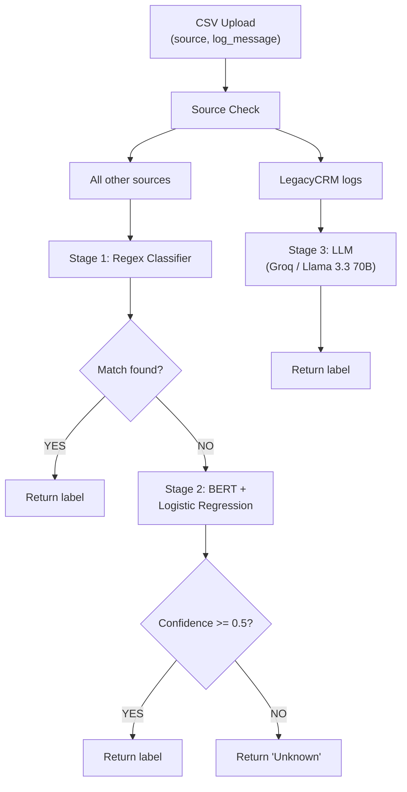

# 🛡️ Hybrid Log Classification System

> A real-world-inspired NLP pipeline that automatically classifies application log messages using a three-stage hybrid approach: Regex → BERT + ML → LLM. Built for cost efficiency, accuracy, and scalability.

---

## Table of Contents

- [Business Problem](#business-problem)
- [Project Summary](#project-summary)
- [Architecture](#architecture)
- [Why Hybrid?](#why-hybrid)
- [Tech Stack](#tech-stack)
- [Project Structure](#project-structure)
- [Setup & Installation](#setup--installation)
- [How to Run](#how-to-run)
- [Docker](#docker)
- [API Reference](#api-reference)
- [Log Categories](#log-categories)

---

## Business Problem

There is a company whose systems generate millions of application log lines daily across multiple source platforms:

| Source System | Description |
|---|---|
| Legacy CRM | Older CRM system with unstructured, complex log patterns |
| Modern CRM | Current CRM with more standardized logs |
| Billing System | Handles invoicing and payment logs |
| HR System | Employee and access management logs |
| Analytics Engine | Data pipeline and reporting logs |

These logs need to be **automatically classified** into actionable categories so that a downstream monitoring system (similar to Splunk) can:

- 🚨 **Create real-time alerts** when critical errors appear
- 🎫 **Auto-generate tickets** (e.g., P1 showstopper tickets) routed to the right team
- 📞 **Call or text the on-call engineer** immediately to minimize damage and downtime

Without automated classification, engineers must manually scan millions of log lines — an impractical and error-prone process that leads to delayed incident response and increased business risk.

### The Core Challenge

Logs are not uniform. They fall into three fundamentally different categories:

1. **Simple, repetitive patterns** — e.g., `"User User1234 logged in."` → easy to match with a regex rule
2. **Complex but well-represented patterns** — enough labeled examples exist to train a machine learning model
3. **Rare or complex patterns with very few examples** — e.g., legacy CRM workflow errors that require understanding context, not just pattern matching

A single-approach solution fails here. Pure regex misses complex cases. Pure ML fails when training data is sparse. Pure LLM is too expensive at scale. The solution is a **hybrid pipeline** that routes each log to the right classifier.

---

## Project Summary

This project implements an end-to-end log classification system with:

- A **three-stage hybrid NLP pipeline** that classifies log messages intelligently and cost-efficiently
- A **FastAPI backend** that accepts CSV uploads and returns labeled results
- A **Streamlit frontend dashboard** for interactive use
- A **trained BERT + Logistic Regression model** for semantic classification
- **Groq/Llama 3.3** LLM integration for low-data edge cases
- **Docker support** for containerized, one-command deployment

---

## Architecture

### High-Level Pipeline



### Stage 1 — Regex Classifier (`processor/processor_regex.py`)

Fast, deterministic, zero-cost rule matching for well-defined log patterns.

- Handles high-volume, predictable log formats
- Uses compiled regex patterns per label category
- Returns `None` if no pattern matches (passes to Stage 2)
- **Examples matched:** `"User User1234 logged in."`, `"Backup completed successfully."`, `"File data.csv uploaded by User265."`

### Stage 2 — BERT + Logistic Regression (`processor/processor_bert.py`)

Semantic ML classification for logs with sufficient training examples.

- Uses `sentence-transformers` (`all-MiniLM-L6-v2`) to generate dense vector embeddings
- Trained logistic regression classifier (scikit-learn) on top of embeddings
- Applies a **confidence threshold of 0.5** — predictions below threshold return `"Unknown"` rather than a wrong label
- Model persisted via `joblib` at `models/log_classifier.joblib`
- **Examples handled:** HTTP status logs, security alerts, critical errors, system notifications

### Stage 3 — LLM via Groq (`processor/processor_llm.py`)

Zero-shot LLM classification for rare or complex patterns with few training examples.

- Uses **Llama 3.3 70B** served via Groq Cloud API (fast inference)
- Applied exclusively to **LegacyCRM** logs — a source with unstructured, complex messages and insufficient training data for ML
- Prompt-engineered for strict output: returns only the category name, no preamble
- **Examples handled:** Workflow errors, deprecation warnings from legacy systems

### Routing Logic (`classify.py`)

```python
if source == "LegacyCRM":
    → Stage 3 (LLM)
else:
    → Stage 1 (Regex)
    if no match:
        → Stage 2 (BERT)
        if confidence < 0.5:
            → "Unknown"
```

---

## Why Hybrid?

A single-model approach cannot satisfy all three requirements simultaneously:

| Requirement | Regex | BERT + ML | LLM |
|---|---|---|---|
| **Cost** | Free | One-time training cost | Per-token API cost |
| **Speed** | Microseconds | Milliseconds | 100s of milliseconds |
| **Accuracy on fixed patterns** | ✅ Highest | ✅ Good | ✅ Good |
| **Accuracy on semantic variety** | ❌ Brittle | ✅ Strong | ✅ Strong |
| **Works with few examples** | ✅ Yes (manual rules) | ❌ Needs data | ✅ Zero-shot |
| **Scales to millions of logs** | ✅ Excellent | ✅ Good | ❌ Expensive |

The hybrid pipeline routes each log to the cheapest classifier that can handle it accurately:

- **~60–70% of logs** are handled by Regex — instant and free
- **~25–35% of logs** are handled by BERT — fast and cheap
- **~5% of logs** hit the LLM — only when necessary

This architecture minimises API costs while maximising classification quality across all log types.

---

## Tech Stack

| Component | Technology |
|---|---|
| Regex classification | Python `re` module |
| Embeddings | `sentence-transformers` (`all-MiniLM-L6-v2`) |
| ML classifier | scikit-learn Logistic Regression |
| LLM classification | Llama 3.3 70B via Groq Cloud API |
| Model persistence | `joblib` |
| API backend | FastAPI + Uvicorn |
| Frontend dashboard | Streamlit |
| Containerization | Docker + Docker Compose |
| Environment config | `python-dotenv` |
| Data | Synthetic CSV dataset |

---

## Project Structure

```
02_log_classification/
├── Dockerfile.backend                      # Docker image for FastAPI
├── Dockerfile.frontend                     # Docker image for Streamlit
├── docker-compose.yml                      # Runs both services together
├── .dockerignore                           # Keeps images lean
├── backend/
│   └── server.py                           # FastAPI app — POST /classify/ endpoint
├── frontend/
│   └── app.py                              # Streamlit dashboard
├── processor/
│   ├── processor_regex.py                  # Stage 1: Regex classifier
│   ├── processor_bert.py                   # Stage 2: BERT + Logistic Regression
│   └── processor_llm.py                    # Stage 3: LLM via Groq
├── models/
│   └── log_classifier.joblib               # Trained ML model (generated by training notebook)
├── resources/
│   └── test.csv                            # Sample input CSV for testing
├── training/
│   ├── dataset/
│   │   └── synthetic_logs.csv              # Training dataset
│   └── training_log_classification.ipynb   # Model training notebook
├── classify.py                             # Orchestrator — routing logic
├── requirements.txt
├── .env                                    # API keys (not committed)
├── .gitignore
└── README.md
```

---

## Setup & Installation

### Prerequisites

- Python 3.10+
- A [Groq API key](https://console.groq.com) (free tier available)

### 1. Clone and create a virtual environment

```bash
git clone <repo-url>
cd 02_log_classification
python -m venv .venv

# Windows
.venv\Scripts\activate

# macOS/Linux
source .venv/bin/activate
```

### 2. Install dependencies

```bash
pip install -r requirements.txt
```

### 3. Configure environment variables

Create a `.env` file in the project root:

```env
GROQ_API_KEY=your_groq_api_key_here
```

### 4. Train the model

Run the training notebook end-to-end to generate the saved model file:

```
training/training_log_classification.ipynb
```

This creates `models/log_classifier.joblib`. The server will not start correctly without this file.

---

## How to Run

### Option A — Local (without Docker)

All commands must be run from the **project root** (`02_log_classification/`).

**Start the backend:**

```bash
uvicorn backend.server:app --reload --port 8000
```

Verify at `http://127.0.0.1:8000/docs` — you should see the `POST /classify/` endpoint.

**Start the frontend** (open a second terminal):

```bash
streamlit run frontend/app.py
```

The dashboard opens at `http://localhost:8501`. Upload a CSV with `source` and `log_message` columns, click **Process Logs via Backend**, and download the labeled output.

---

### Option B — Docker

See the [Docker](#docker) section below.

---

## Docker

Docker lets you run the entire app — backend and frontend — with a single command, no Python environment setup required on the host machine.

### Prerequisites

- [Docker Desktop](https://www.docker.com/products/docker-desktop/) installed and running
- `.env` file with your `GROQ_API_KEY` at the project root
- `models/log_classifier.joblib` already generated (run the training notebook first)

### Services

| Service | Image | Port |
|---|---|---|
| `backend` | FastAPI + Uvicorn | `8000` |
| `frontend` | Streamlit | `8501` |

The frontend container waits for the backend healthcheck to pass before starting. Inside Docker, the two containers communicate via the internal service name `backend` — not `localhost`.

### Build and start

```bash
# From the project root:
docker-compose up --build
```

Then open:
- **Frontend dashboard →** `http://localhost:8501`
- **Backend API docs →** `http://localhost:8000/docs`

### Run in background

```bash
docker-compose up --build -d
```

### Stop all containers

```bash
docker-compose down
```

### Rebuild after code changes

```bash
docker-compose up --build
```

---

## API Reference

### `POST /classify/`

Accepts a CSV file upload and returns a labeled CSV.

**Request**

| Field | Type | Description |
|---|---|---|
| `file` | `multipart/form-data` | CSV file with `source` and `log_message` columns |

**Required CSV columns**

| Column | Description | Example |
|---|---|---|
| `source` | Origin system of the log | `"LegacyCRM"`, `"BillingSystem"` |
| `log_message` | Raw log text | `"User User1234 logged in."` |

**Response**

Returns the same CSV with an additional `label` column.

**Example using curl**

```bash
curl -X POST "http://127.0.0.1:8000/classify/" \
  -F "file=@resources/test.csv" \
  --output classified_output.csv
```

**Error responses**

| Code | Reason |
|---|---|
| `400` | File is not a CSV, or missing required columns |
| `500` | Internal classification error (check server logs) |

---

## Log Categories

| Category | Classifier Used | Example |
|---|---|---|
| User Action | Regex | `"User User1234 logged in."` |
| System Notification | Regex | `"Backup completed successfully."` |
| HTTP Status | BERT | `"GET /v2/servers/detail HTTP/1.1 RCODE 200"` |
| Security Alert | BERT | `"IP 192.168.1.1 blocked due to potential attack"` |
| Critical Error | BERT | `"System crashed due to driver errors"` |
| Workflow Error | LLM | `"Case escalation for ticket ID 7324 failed..."` |
| Deprecation Warning | LLM | `"The 'ReportGenerator' module will be retired in v4.0..."` |
| Unknown | Fallback | Low-confidence prediction or unrecognised pattern |
